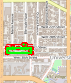

# Group Members
| Name                  	| Email            	| USC ID     	|
|-----------------------	|------------------	|------------	|
| Aditya Anulekh Mantri 	| adityaan@usc.edu 	| 8049574464 	|
| Aditi Bodhankar       	| bodhanka@usc.edu 	| 9323549368 	|

# Notation

Through this report the variables represent the following unless stated otherwise

N - Number of nodes in the database
# Phase 1

## Autocomplete
Time Complexity - O(m*N) where m is the size of the input

* Convert all alphabets to lower case
* Iterate through all the points in the map
* If length of input is greater than the current name, skip the word (Ex: input - Starbucks 1, current - Starbucks)
* Convert name to lower case
* Find the input in the current name using `std::find`. If input is found in current name, add that to the result vector

## Get Position
Time Complexity - O(N)

* Iterate through all the points in the map and return the latitude and longitude of the matched name
* If no match is found return (-1, -1)
* In the case where no match is found, find the closest name to the entered input

## Find Closest Name
Time Complexity - O(N*O(CalculateEditDistance))

* This function calls `CalculateEditDistance` internally on every name in the map data
* The function skips entries that are empty strings
* The name with the lowest edit distance is returned as a string from this function

## Calculate Edit Distance
Time Complexity - 

* Initialize a matrix `dp` of size (`a.size()` x `b.size()`) with zeros
* Intialize the first row and first column of the above matrix with 0 to `a.size()` and 0 to `b.size()`. This is to handle the base cases

    * a = "", b = "abc"
    * a = "abc", b = ""

* Update all the elements of `dp` according to the following rules

    * If the characters at index `i` and `j` in `a` and `b` match, dp[i][j] = dp[i-1][j-1]
    * If the characters at index `i` and `j` don't match in `a` and `b` dp[i][j] = 1 + min(dp[i-1][j-1], dp[i-1][j], dp[i][j-1])

* Finally return the value at `dp[a.size()][b.size()]`

**Example table for inputs "abc" and "adc"**

|   	| Base Case 	| a 	| b 	| c 	|
|:-:	|:---------:	|:-:	|:-:	|:-:	|
|   	|     0     	| 1 	| 2 	| 3 	|
| a 	|     1     	| 0 	| 1 	| 2 	|
| d 	|     2     	| 1 	| 1 	| 2 	|
| c 	|     3     	| 2 	| 2 	| 1 	|

| Output | Map |
| :---: | :---: |
|  | 

# Phase 2

## Calculate Shortest Path
### Dijkstra's Algorithm: 

Time Complexity: O(Elog(N)); where E: number of edges

* Initialized a map `distance` to store the distance from start to each node
* Initialized the distances to infinity
* Initialized a map `previous`to store the previous node of each node
* Initialized a map `visited` to all `False`to store the visited nodes
* Then obtained the id of the source and the destination locations
* Corner case: If the start and goal locations are the same, returned an empty path
* Initialized a priority queue to get the closest neighbor for every unvisited node. the function `CalculateDistance` is used to calculate the distances between the neighbors and the current node to update the closest neighbor
* Once the closest neighbor is obtained it is appended into the `previous` map defined as above
* Finally the path is created using the nodes from the `previous` map

### Bellman Ford Algorithm:

Time Complexity: O(E*N); where E: number of edges

* Similar to the above algorithm, two maps for `distance` and `previous` are initialized 
* The distances of all the nodes are initialized to be infinity
* Then obtained the id of the source and the destination locations
* Corner case: If the start and goal locations are the same, returned an empty path
* The distance of the source is initialized to 0. As the algorithm traverses over all edge possibilities (minimum number of edges needed to find the shortest path), we calculate the shortest distance of every node from all its neighbors. 
* **Early Termination:** An additional STOP sign is added into the algorithm to hault the program once the minimum distances do not vary with more number of edges.
* All the closest neighbors are then added into the `previous` map
* Since, this algorithm evaluates all the possible paths between any two nodes, it has a longer run time than Dijkstra's algorithm.

| Dijkstra's | Bellman Ford | Output |
| :---: | :---: | :---: |
| |  |  |

## Cycle Detection

### `inSquare`
* Given four coordinates - the left and right longitides and the top and bottom latitudes, this function calculates if a node is present in the square created by the four points

### `GetSubgraph`

* It returns all nodes present in the square. These nodes form a subgraph which is later used to create a graph for cycle detection

### `CycleDetectionHelper`

* Visit the node only if it is in the subgraph obtained using the function - `GetSubgraph`. Then mark the node as visited. 
* Find all the unvisited neighboring nodes of the current node.
* If the node is unvisited, then we call this function on itself recursively. 
* If we reach a node that is already visited, and if it is not connected to its parent, then we conclude that we have found a cycle.

### `CycleDetection`

Time Complexity: O(E+N); where E: number of edges

* Check if there is a cycle within a square graph
* Implementation: 
    * Use a helper function - `CycleDetectionHelper` recursively
    * DFS approach
* Algorithm:
    * We first create an unordered map - `visited` to store the visited nodes
    * Then we initialize this `visited` map to `False`
    * Then we call the recursive function introduced above on each child of the current node just like in the DFS algorithm. The recursion ends once we reach an already visited node.

| Output | Map |
| :---: | :---: |
|  |  |

## Delivering Trojan

Time Complexity: O(E+N); where E: number of edges

The delivering trojan function is based on topological sort. Topological sort is applicable only on Directed Acyclic Graphs(DAG)
* Create a graph from the given locations and dependencies
* Check if the graph created is a DAG or not. If the input graph is not DAG, return empty vector indicating that a topological sort doesn't exist
* `DeliveringTrojan` function uses two helper functions
    * One funcion to check if the input graph is DAG - `is_dag`
    * One function to perform the topological sort recursively - `TopologicalSort`

### `is_dag`

* This function takes the locations and dependencies as inputs and checks if the graph formed by them is DAG or not
* The function maintains two vectors - `visited` and `stack` to store the nodes that are visited and the nodes that are being visited respectively
* If the function is recursively called on a node that is being visited (meaning that it is a part of the `stack`), it means that we have encountered a back edge and the graph is not DAG

### `TopologicalSort`

* This is a utility function that is called recursively from the `DeliveringTrojan` function
* The function calls itself on all **unvisited** nodes
* A node is added to the `result` vector when all the neighbors of the node are visited

The final result vector is the reverse of the list formed by the helper function. This is the topological sort

There are miscalleaneous functions - `ReadDependenciesFromCSVFile` and `ReadLocationsFromCSVFile` additionally used to read the locations and the dependencies files needed for topological sort

| Input | Topological Sort Output | Topological Sort Graph |
| :---: | :---: | :---: |
| |  |  |

# Phase 3
## Travelling Salesman Problem

Here we caluclate a round path starting and ending at the same location but passing through a set of all nodes with the minimum distance. To solve this problem we implement three algorithms - 

    1. Brute-force

    2. Backtracking

    3. 2-OPT
### `TravellingTrojan_Brute_force`

RUNTIME COMPLEXITY: O(n!) where n is the number of locations to visit

* We first initialize the minimum distance - `min_distance` to infinity.
* Then we initialize a vector of strings to store the current path.
* We assume that the `start` node is the first location in the `locations` string given to us which consists of all the nodes need in the final path.
* We initialize an unordered map to store the distance from the `start` node to each node. The distance of the `start` node is initialized to 0.
* We calculate the distance from start to each node and store it in the above map.
* We introduce a new variable called `curr_distance` and initialize it to 0.
* Initialize the vector to store the optimal path
* Call the brute-force helper function
* update the minimum  distance and add the optimal path into the `records` output

### `TravellingTrojan_Brute_force_helper`

* If the current node is the last node, then we update the minimum distance
* Else evaluate all the children of the current node, and add the current node to the path
* We then call the helper function recursively on each child node

### `TravellingTrojan_Backtracking`

RUNTIME COMPLEXITY: O(n!)

* The implementation is same as in the Brute-force case with only three additional lines of code which form the central element of the 'Backtracking' approach
* After evaluating each path, we check if the current path is larger than the minimum distance and if yes, then we do not check for any path down that particular node and back track to the next child node and continue the similar logic

### `TravellingTrojan_2opt`

RUNTIME COMPLEXITY: O(n^2)

* We start with initializing a vector to store the existing path
* Then we initialize a vector to store the new path. We also create a best distance variable - `best_distance` and initialize it to infinity
* We then initiliaze a flag to check if any improvement is made in finding the optimal path
* We swap a subset of the existing path if the total distance of this path is smaller than the initial best path.
* We then update the best path, the minimum distance and add it to records

The output recordings of the above algorithms are uploaded to YouTube as unlisted videos here

* [Brute Force](https://youtu.be/tIpWIYPjCeU)
* [Backtracking](https://youtu.be/yzlvhs6gS2s)
* [2-opt](https://youtu.be/voqzLJJNIjg)

Below are short snippets from the above videos

| Brute Force                        	| Backtracking                                  	| 2-opt                                 	|
|------------------------------------	|-----------------------------------------------	|---------------------------------------	|
|  	|  	|  	|
| |  |  |

Below is a comparison of the distances from the three algorithms generated using Google Benchmark. The code to generate the following output is 

| Number of Locations | 2-opt | Brute Force 	| Backtracking 	|
|:-----:| :----------------:| :------------:|-------------	|
| 2  	| 2.29252       	| 2.29252     	| 2.29252     	|
| 3  	| 2.53762       	| 2.53762     	| 2.53762     	|
| 4  	| 6.31646       	| 6.31646     	| 6.31646     	|
| 5  	| 6.56154       	| 6.56154     	| 6.56154     	|
| 6  	| 6.58303       	| 6.58303     	| 6.58303     	|
| 7  	| 6.6282        	| 6.6282      	| 6.6282      	|
| 8  	| 7.97046       	| 7.97046     	| 7.97046     	|
| 9  	| 7.97827       	| 7.97827     	| 7.97827     	|
| 10 	| 10.2832       	| 10.2832     	| 10.2832     	|
| 11 	| 9.30392       	| 9.30392     	| 9.30392     	|

## FindNearby

Time Complexity: O(Nlog(N))
### `FindNearby`

* Given a class name C, a location name L and a radius (number) r, this function finds the 'k' nearest locations in class C on the map near L with the range of r and return a vector of string ids.
* Algorithm:
    * We create a priority queue to store the distance from the source to the node (min heap)
    * Then we get the locationid of the Location name 'L'
    * We iterate through all the data points to check if the given `attributeName` exists in the attributes of the node. If yes, we add it to the priority queue. We also calculate the distance between location and the node and add it to the priority queue
    * We then check for the top 'k' nearest nodes in the priority queue and pop them if they lie within the distance 'r'. And if the queue is empty, we return an empty string.

| Output | Map |
| :---: | :---: |
|  |  |

# Additional Implementations

## Google Benchmarking

### Benchmarking of Travelling Salesperson Algorithms

We used [Google Benchmark](https://github.com/google/benchmark) to accurately measure the runtime of travelling salesperson algorithms against increasing input sizes.

**Observations**

* It was observed that the brute force and backtracking algorithms were more than 10 minutes for input sizes greater than 10 nodes.
* 2-opt heuristic approach on the other hand was able to converge significantly quicker than brute force and backtracking
* Below is a graphical representation of the growing runtimes of the three algorithms

As it can be seen in the above figure, 2-opt algorithm has a significantly lower runtime for inputs that are 2 times that of brute force and backtracking.

# Future Work and Learnings:

### Future Work:
* 3-opt and Genetic algorithm for Travelling Salesperson Problem

### Learnings:
* Using a heap over a vector reduces time complexity in cases where sorting is important
* Using Dynamic Programming in algorithms reduces the call stack and improves the runtime of the program
* Building an end-to-end C++ application

  

